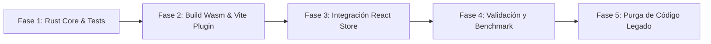

# 🦀 Plan Maestro de Migración: Arquitectura Unificada con Rust + WebAssembly (Wasm)

Este documento detalla el plan estratégico, arquitectónico y operativo para migrar el proyecto **Rubik's Cube Graph Visualizer & AI Solver** de una arquitectura distribuida (Docker + ArangoDB + FastAPI/Python + React/Vite) a un sistema **100% Client-Side de alto rendimiento**, unificado mediante **Rust compilado a WebAssembly (Wasm)** y consumido directamente en el Frontend.

---

## 🎯 1. Diagnóstico y Justificación del Cambio

### 1.1 Estado Actual (Arquitectura Legada de 3 Servicios)
- **Servicio 1:** Contenedor Docker con **ArangoDB 3.11** en el puerto `8529` (consumo de ~300-500 MB de RAM y dependencia de demonio Docker activo).
- **Servicio 2:** Backend en **Python (FastAPI + Uvicorn + NumPy + python-arango)** en el puerto `8000`.
- **Servicio 3:** Servidor de desarrollo Frontend en **Node.js (Vite + React)** en el puerto `5173`.
- **Problemas:** 
  - Fricción de despliegue y desarrollo local (múltiples terminales, dependencias cruzadas de Python, Docker y Node).
  - Latencia HTTP innecesaria entre cada giro del cubo y la persistencia del grafo.
  - Imposibilidad de desplegar como un sitio web estático (e.g. GitHub Pages / Vercel).

### 1.2 Estado Futuro (Arquitectura Unificada Zero-Services)
- **Cero servidores activos en segundo plano:** Sin contenedores Docker, sin procesos Python ni sockets HTTP.
- **Rendimiento Nativo en Navegador:** El motor del cubo y el grafo se ejecutan en **Rust compilado a WebAssembly** a velocidad de CPU nativa, sin pausas por Garbage Collector.
- **UI Reactiva en React:** Conserva todo el visor 3D Three.js y el visor de grafos 3D, comunicándose con Wasm mediante memoria síncrona compartida.
- **Portabilidad Total:** El build final (`npm run build`) produce un bundle estático (HTML + JS + WASM) listo para ejecutarse en cualquier navegador o CDN estático.

---

## 🏗️ 2. Comparativa de Componentes (Actual vs. Destino)

| Componente | Implementación Actual (Legada) | Implementación Destino (Rust + Wasm) | Acción |
| :--- | :--- | :--- | :--- |
| **Persistencia de Grafo** | ArangoDB (Docker) | Estructura en memoria Rust (`hashbrown::HashMap` / `petgraph`) con opción de persistencia en `LocalStorage` o `IndexedDB` en JSON. | **Reemplazar y Eliminar ArangoDB** |
| **Motor Lógico** | Python / NumPy ([`src/cube_engine.py`](file:///home/erickaguilar/Documentos/rubik-graph-visualizer/src/cube_engine.py)) | Rust Crate (`wasm_core`) con arrays contiguos `[u8; 54]` y operaciones bit a bit. | **Reescribir en Rust y Eliminar Python** |
| **API & Routing** | FastAPI ([`src/api.py`](file:///home/erickaguilar/Documentos/rubik-graph-visualizer/src/api.py)) | No requerida. Funciones Wasm invocadas síncronamente vía `wasm-bindgen`. | **Eliminar FastAPI** |
| **Solver de Grafo** | Consultas AQL en ArangoDB (Shortest Path) | BFS bidireccional / A* ultra-rápido en Rust compilado a Wasm. | **Reescribir en Rust** |
| **Frontend Visual** | React 19 + Three.js + Zustand + Axios | React 19 + Three.js + Zustand + Bindings directos de Wasm. | **Conservar y Actualizar Store** |
| **Servidor MCP** | Python ([`src/mcp_server.py`](file:///home/erickaguilar/Documentos/rubik-graph-visualizer/src/mcp_server.py)) | Opcional: Puede mantenerse como herramienta standalone CLI en Rust si se requiere integración agéntica externa. | **Deprecar versión Python** |

---

## 🗄️ 3. Desmantelamiento de ArangoDB y su Reemplazo en Rust

### 3.1 ¿Para qué se usaba la base de datos actualmente?
En la arquitectura legada, ArangoDB operaba como base de datos orientada a grafos cumpliendo 4 funciones:
1. **Almacenar estados del cubo (Nodos):** Cada configuración única de 54 stickers se registraba en la colección de documentos `CubeStates` con campos `{ _key: hash, is_solved: bool }`.
2. **Almacenar transiciones (Aristas):** Cada movimiento aplicado conectaba dos nodos en la colección de aristas `StateTransitions` con `{ _from: "CubeStates/A", _to: "CubeStates/B", move: "R" }`.
3. **Exploración de vecindarios (Subred 3D):** Para no saturar el visor WebGL con millones de nodos, la API ejecutaba una consulta AQL de recorrido (`FOR v, e IN 0..2 ANY @start_id GRAPH 'RubikGraph'`) para extraer nodos y aristas a distancia 2 del estado actual.
4. **Resolución por camino más corto (Solver A*):** Al solicitar resolución, ArangoDB ejecutaba un algoritmo AQL de búsqueda de ruta mínima (`SHORTEST_PATH`) entre el nodo actual y el nodo resuelto (`target_hash`), devolviendo la secuencia de aristas a invertir o ejecutar.

### 3.2 ¿Cuál es su reemplazo exacto en Rust?
El contenedor Docker de ArangoDB se elimina por completo y sus 4 responsabilidades se trasladan a la memoria nativa del navegador mediante Rust:

1. **Grafo en memoria RAM (`StateGraph` en Rust):**
   - **Nodos:** `HashMap<[u8; 54], NodeData>` (almacena el estado, color, tamaño y si está resuelto).
   - **Aristas:** Vector de transiciones contiguas `Vec<TransitionEdge>` en memoria.
2. **Solver Instantáneo (BFS / A* en Rust):**
   - Un algoritmo de búsqueda en anchura bidireccional implementado en Rust sobre las referencias en memoria.
   - **Latencia:** Pasa de ~50–100 ms (petición HTTP + consulta AQL de BD) a **< 1 ms** (acceso a memoria directa sin serialización).
3. **Filtro de Vecindario Directo:**
   - La función `get_neighborhood(center_state, depth)` recorre el grafo en memoria y serializa al instante `{ nodes, links }` directo a JavaScript mediante `serde-wasm-bindgen`.
4. **Persistencia Web Opcional (Sin Servidores):**
   - Para no perder el mapa de estados al refrescar la página, el grafo puede sincronizarse automáticamente con el almacenamiento del navegador (**`IndexedDB`** o **`LocalStorage`**) en formato JSON ligero, sin necesidad de ningún servicio externo ni credenciales.

### 3.3 Comparativa Técnica: ArangoDB vs. Grafo Rust/Wasm

| Métrica | ArangoDB 3.11 (Docker) | Grafo en Memoria Rust (Wasm) | Mejora |
| :--- | :--- | :--- | :--- |
| **Infraestructura** | Contenedor Docker obligatorio | **0 dependencias**, corre en la pestaña del navegador | Eliminación total de Docker |
| **Consumo de Memoria** | ~300 MB a 500 MB (demonio de BD) | **~5 MB a 15 MB** (estructuras contiguas de Rust) | Reducción de ~97% de RAM |
| **Latencia de Consulta** | 20 ms – 100 ms (Red local + I/O disco) | **< 1 ms** (acceso directo a CPU/RAM) | ~100x más rápido |
| **Portabilidad** | Limitado a entornos con Docker | **Cualquier navegador web moderno** | Universal |

---

## 📐 4. Diseño del Core en Rust (`wasm_core`)

### 4.1 Estructura del Crate Rust
Se creará un crate en la raíz del proyecto o dentro de `crates/wasm_core`:
```text
crates/wasm_core/
├── Cargo.toml
└── src/
    ├── lib.rs              # Punto de entrada wasm-bindgen y API JS
    ├── cube.rs             # Estado del cubo [u8; 54], movimientos y permutaciones
    ├── graph.rs            # Topología de estados, nodos, aristas y búsqueda BFS
    └── types.rs            # Estructuras exportables a JS (GraphData, MoveResult)
```

### 4.2 Representación en Memoria
- **Estado del Cubo:**
  ```rust
  #[derive(Clone, Copy, PartialEq, Eq, Hash, Debug)]
  pub struct CubeState {
      pub stickers: [u8; 54], // Caras: 0=U, 1=R, 2=F, 3=D, 4=L, 5=B
  }
  ```
- **Grafo en Memoria:**
  ```rust
  pub struct TopologyGraph {
      nodes: HashMap<String, NodeData>, // Hash -> Node
      edges: Vec<EdgeData>,             // Transiciones registradas
  }
  ```
- **Exportación a Wasm:**
  Se usarán `wasm-bindgen` y `serde-wasm-bindgen` para serializar de forma inmediata la topología requerida por `react-force-graph-3d` (`{ nodes, links }`).

---

## 🔄 5. Plan de Integración en el Frontend (React + Vite)

### 5.1 Plugins de Vite
Instalación de `vite-plugin-wasm` y `vite-plugin-top-level-await` en `frontend/` para permitir la importación nativa de `.wasm`:
```bash
npm install -D vite-plugin-wasm vite-plugin-top-level-await
```
Configuración en `frontend/vite.config.ts`:
```typescript
import wasm from "vite-plugin-wasm";
import topLevelAwait from "vite-plugin-top-level-await";

export default defineConfig({
  plugins: [react(), wasm(), topLevelAwait()]
});
```

### 5.2 Actualización de [`frontend/src/store.ts`](file:///home/erickaguilar/Documentos/rubik-graph-visualizer/frontend/src/store.ts)
- Eliminar la dependencia de `axios` y las peticiones a `http://localhost:8000/api/...`.
- Inicializar el módulo Wasm una sola vez en el arranque.
- Al ejecutar `commitMove(move)`:
  - Invocar `wasmGraph.apply_move(move)`.
  - Recibir la subred / vecindario actualizado en $< 1$ ms y enviarlo directamente a `setGraphData`.
- Al ejecutar `solveCube()`:
  - Invocar `wasmGraph.find_shortest_path_to_solved()`.
  - Encolar los movimientos resultantes en la cola de animación 3D de inmediato.

---

## ☁️ 6. Despliegue en Vercel (100% Funcional y Serverless/Static)

### 6.1 ¿Por qué funciona al 100% en Vercel?
Al compilar Rust a WebAssembly, la aplicación deja de requerir un servidor de backend dinámico. Se convierte en una **Single Page Application (SPA) estática**:
- **Cero servidores backend:** Vercel solo actúa como una CDN global sirviendo `index.html`, los chunks de JavaScript, CSS y el archivo binario `.wasm` comprimido.
- **Cómputo en el cliente (Edge/Client-Side):** Toda la lógica matemática, la manipulación del grafo, el cálculo de rutas A* y el render 3D WebGL se ejecutan en la CPU y GPU del dispositivo del usuario que visita la web.
- **Escalabilidad infinita sin costos:** No hay bases de datos que puedan colapsar ni instancias de cómputo en la nube consumiendo créditos. Puede recibir 1 usuario o 100,000 concurrentes con costo $0 en el tier gratuito de Vercel.

### 6.2 Configuración del Despliegue en Vercel
Para un flujo de CI/CD continuo sin requerir instalar la toolchain de Rust en los servidores de Vercel:

1. **Estrategia de artefactos precompilados:**
   - La carpeta compilada `frontend/src/pkg` (que contiene `wasm_core_bg.wasm` y los tipos TypeScript generados por `wasm-pack`, ocupando menos de 100 KB) se incluye en el repositorio git.
2. **Configuración en Vercel Dashboard:**
   - **Root Directory:** `frontend`
   - **Framework Preset:** `Vite`
   - **Build Command:** `npm run build`
   - **Output Directory:** `dist`
3. **Resultado:**
   Vercel compila el bundle con Vite en ~20 segundos y entrega una URL pública (`https://rubik-graph-visualizer.vercel.app`) donde el cubo 3D, el grafo interactivo y el solver funcionan de forma autónoma.

---

## 🗑️ 7. Plan de Eliminación de Código Legado (Legacy Clean-Up)

Una vez verificada la funcionalidad en Wasm, se procederá con la limpieza estricta del proyecto para evitar código muerto y confusión:

### 5.1 Servicios y Docker
1. **Detener y eliminar contenedores y volúmenes:**
   ```bash
   docker compose down -v
   ```
2. **Eliminar archivo de orquestación:**
   - Borrar `docker-compose.yml`.

### 5.2 Backend Python
1. **Eliminar archivos de servidor y lógica Python:**
   - Eliminar `src/api.py`.
   - Eliminar `src/database.py`.
   - Eliminar `src/cube_engine.py`.
   - Eliminar `src/mcp_server.py`.
   - Eliminar `tests/test_cube_engine.py` (se reemplaza por tests unitarios en Rust con `cargo test`).
2. **Eliminar entorno virtual y cachés:**
   - Borrar `.venv/`.
   - Borrar `.pytest_cache/`.
   - Borrar `src/__pycache__/`.
   - Borrar `requirements.txt` si ya no existe código Python.

### 5.3 Limpieza en Frontend
1. En `frontend/package.json`, remover la dependencia de `axios` (`npm uninstall axios`).
2. Actualizar scripts en `package.json` raíz o de frontend para compilar Wasm previo al dev/build:
   ```json
   "build:wasm": "cd crates/wasm_core && wasm-pack build --target web --out-dir ../../frontend/src/pkg",
   "dev": "npm run build:wasm && cd frontend && npm run dev"
   ```

### 7.4 Documentación
- Actualizar [`README.md`](file:///home/erickaguilar/Documentos/rubik-graph-visualizer/README.md) reflejando la nueva arquitectura sin Docker ni Python.
- Actualizar [`CHANGELOG.md`](file:///home/erickaguilar/Documentos/rubik-graph-visualizer/CHANGELOG.md) registrando la versión 2.0.0 (Migración a Rust/Wasm).

---

## 📅 8. Fases de Ejecución Paso a Paso



### Fase 1: Implementación del Core en Rust
- Crear `crates/wasm_core`.
- Portar la lógica de ciclos de stickers y movimientos ($U, U', U2, D, \dots$) desde `cube_engine.py` a Rust.
- Implementar la estructura del grafo en memoria y algoritmo de camino más corto (BFS).
- Escribir tests unitarios en Rust (`cargo test`) garantizando paridad matemática exacta con el motor original.

### Fase 2: Configuración de WebAssembly y Vite
- Configurar `wasm-pack` con salida a `frontend/src/pkg`.
- Configurar `vite-plugin-wasm` en el proyecto React.
- Comprobar que Vite carga el módulo `.wasm` correctamente en desarrollo.

### Fase 3: Conexión del Frontend con Wasm
- Modificar `store.ts` para sustituir llamadas Axios por métodos del módulo Wasm.
- Conectar la actualización del grafo 3D (`ForceGraph3D`) con los datos emitidos por Wasm.
- Conectar la resolución con el algoritmo de Wasm.

### Fase 4: Validación y Verificación Funcional
- Comprobar que todos los giros se animan correctamente en Three.js.
- Comprobar que los nodos y aristas se crean y colorean adecuadamente en el grafo 3D.
- Probar la resolución automática desde diferentes profundidades de mezcla.
- Ejecutar `npm run build` y verificar que el artefacto estático funcione sin ningún servidor backend.

### Fase 5: Purga y Limpieza Final
- Apagar y remover el contenedor Docker ArangoDB.
- Eliminar la carpeta `src/`, `tests/` antiguos, `.venv/` y `docker-compose.yml`.
- Actualizar `README.md` con las nuevas instrucciones de ejecución (un único `npm run dev`).

---

## 🛡️ 9. Plan de Rollback y Contingencia
- Todo el trabajo se desarrollará en una rama específica: `feature/rust-wasm-migration`.
- Los archivos legados solo se eliminarán en la Fase 5 una vez que la rama feature esté 100% probada y funcional.
- Si surge cualquier impedimento con WebAssembly, la rama `develop` conservará la versión operativa previa con Docker y Python.
