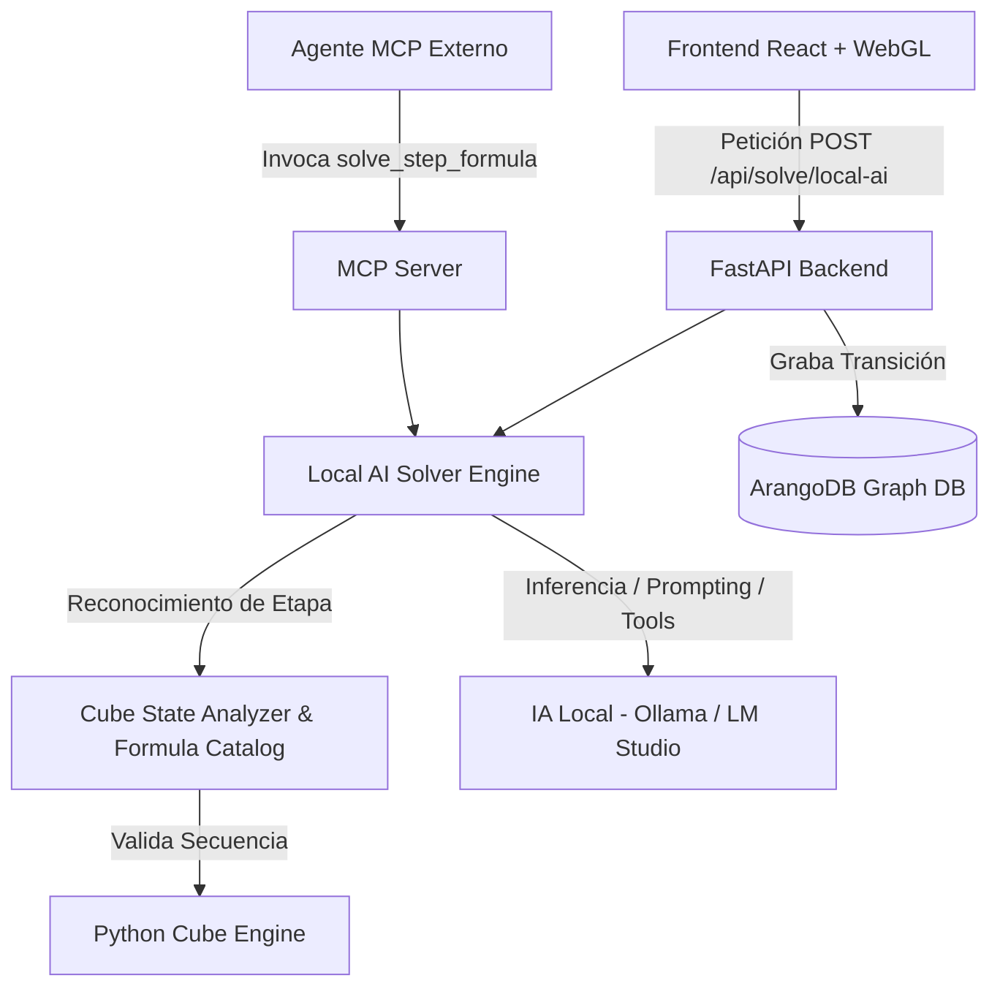

# 🧠 Planificación e Implementación: Módulo de IA Local y Resolución por Fórmulas

Este documento describe la arquitectura, diseño técnico y plan de implementación para integrar un módulo de **Resolución por IA Local basada en Fórmulas Algorítmicas** (Método Principiante LBL / CFOP) en el proyecto **Rubik's Cube Graph Visualizer**.

---

## 🎯 1. Objetivos del Módulo

- **Integración con IA Local:** Permitir la conexión directa con motores de IA ejecutados localmente (ej. **Ollama**, **LM Studio**, **LocalAI**, **vLLM**) mediante una API HTTP OpenAI-compatible o cliente Ollama.
- **Razonamiento por Fórmulas Humana-Legibles:** En lugar de búsqueda en grafo por fuerza bruta, la IA resolverá el cubo identificando la etapa actual y aplicando secuencias estándar de la Teoría de Grupos del Cubo de Rubik (ej: *Sexy Move*, *Sune*, *T-Perm*, etc.).
- **Trazabilidad y Explicabilidad (Explainable AI):** Mostrar en el Frontend la deducción paso a paso de la IA, justificando por qué aplica cada algoritmo en cada estado del cubo.
- **Integración Agéntica vía MCP:** Extender las herramientas del servidor **Model Context Protocol (MCP)** para que agentes autónomos externos puedan utilizar la biblioteca de fórmulas.

---

## 🏗️ 2. Arquitectura del Sistema

---

## ⚙️ 3. Componentes a Desarrollar

### A. Catálogo de Fórmulas y Analizador de Estados (`src/formulas.py` & `src/cube_analyzer.py`)
- **Detector de Etapas del Cubo:**
  1. `DAISY_CROSS`: Cruz blanca / capa inferior.
  2. `FIRST_LAYER_CORNERS`: Esquinas de la primera capa.
  3. `MIDDLE_LAYER_EDGES`: Aristas de la capa intermedia.
  4. `OLL_YELLOW_CROSS`: Cruz amarilla en la capa superior.
  5. `OLL_YELLOW_CORNERS`: Orientación de esquinas amarillas.
  6. `PLL_CORNER_PERMUTATION`: Permutación de esquinas finales.
  7. `PLL_EDGE_PERMUTATION`: Permutación de aristas finales (Cubo Resuelto).
- **Catálogo de Algoritmos:**
  - *Trigger R U R' U'* (Sexy Move)
  - *Trigger L' U' L U* (Left Sexy)
  - *Sune:* `R U R' U R U2 R'`
  - *Anti-Sune:* `R U2 R' U' R U' R'`
  - *A-Perm:* `R' F R' B2 R F' R' B2 R2`
  - *U-Perm:* `R U' R U R U R U' R' U' R2`

### B. Motor Solver con IA Local (`src/local_ai_solver.py`)
- **Adaptador de Cliente HTTP Local:**
  - Soporte para endpoints locales: `http://localhost:11434` (Ollama) o `http://localhost:1234/v1` (LM Studio).
  - Configurable vía variables de entorno (`LOCAL_AI_URL`, `LOCAL_AI_MODEL`).
- **Lógica de Inferencia:**
  - Enviar el estado abreviado del cubo y la etapa detectada al LLM.
  - Solicitar al LLM la selección del siguiente movimiento o la secuencia de fórmula requerida.
  - Validar sintácticamente los movimientos devueltos ($F, R, U, B, L, D$ y sus inversos $F', R', \dots$).

### C. Endpoints de la API Backend (`src/api.py`)
- `GET /api/ai/models`: Lista los modelos locales disponibles en el runtime de IA (ej: `llama3.2`, `qwen2.5-coder`).
- `POST /api/ai/solve-step`: Analiza el estado actual, consulta a la IA local y retorna el siguiente paso con su explicación y fórmula.
- `POST /api/ai/solve-auto`: Ejecuta en bucle la solución asistida por IA hasta alcanzar el estado identidad.

### D. Servidor MCP (`src/mcp_server.py`)
- Nueva herramienta MCP: `analyze_cube_stage(state_hash)` -> Retorna la etapa actual del cubo y las fórmulas sugeridas.
- Nueva herramienta MCP: `apply_formula(formula_name)` -> Ejecuta la secuencia macro en el estado actual.

### E. Frontend React & UI (`frontend/src/`)
- **Selector de Proveedor/Modelo de IA Local:** Dropdown en el panel lateral para elegir el modelo activo.
- **Consola de Razonamiento IA:** Componente visual para mostrar los logs de deducción ("Analizando capa intermedia... Aplicando fórmula `U R U' R' U' F' U F`").
- **Modo Asistido / Automático:** Botón para resolver paso a paso o animación automática sincronizada con Three.js.

---

## 📅 4. Plan de Implementación por Fases

| Fase | Tareas Principales | Archivos Modificados / Creados |
| :--- | :--- | :--- |
| **Fase 1: Motor de Fórmulas** | Crear analizador de capas y diccionario de movimientos/fórmulas LBL. | `src/formulas.py` `src/cube_analyzer.py` `tests/test_formulas.py` |
| **Fase 2: Cliente IA Local** | Implementar cliente Ollama/OpenAI API para inferencia y estructuración de prompts. | `src/local_ai_solver.py` `tests/test_local_ai.py` |
| **Fase 3: API REST & MCP** | Agregar endpoints FastAPI y registrar nuevas herramientas MCP. | `src/api.py` `src/mcp_server.py` |
| **Fase 4: Interfaz Web 3D** | Añadir selector de modelo local, consola de logs y animación paso a paso en React. | `frontend/src/store.ts` `frontend/src/components/AIPanel.tsx` `frontend/src/App.tsx` |
| **Fase 5: Validación & Pruebas** | Probar flujo completo con Ollama (`llama3.2` / `qwen2.5`) y verificar persistencia en ArangoDB. | `tests/` |

---

## 🚀 5. Próximos Pasos

1. Iniciar la creación del módulo `src/formulas.py` y `src/cube_analyzer.py` con las reglas de detección de etapas.
2. Configurar la integración básica de Ollama/API local.
3. Actualizar la interfaz de usuario para permitir la resolución por fórmulas.
